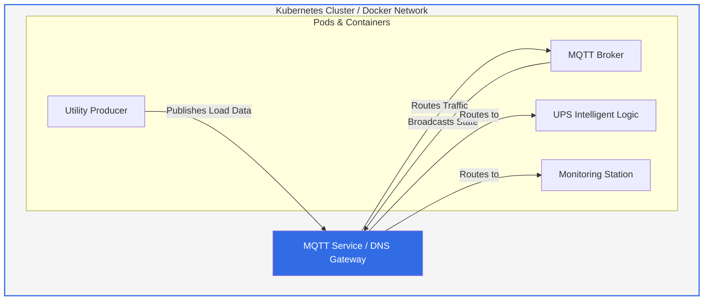

# ⚡ VoltGuard-DCEO-Sim ⚡
Automated DCEO simulation engine developed by **Frank Fru**. This project replicates a critical infrastructure environment where an intelligent UPS monitors utility grid loads and manages power transitions via MQTT telemetry.

## 🏗️ System Architecture
The simulation operates on a microservices architecture designed for both local Docker environments and production-grade **Kubernetes (K8s)** clusters.

🧩 Component BreakdownMQTT Broker (Mosquitto): The central communication hub using a Publish/Subscribe model to route data between services.Utility Producer: Simulates the power grid. It generates load values and publishes them to the voltguard/utility/load topic.UPS Intelligent Logic: The "Brain" of the system. If the load exceeds 75.0, it triggers a simulated "Battery Mode" to protect the data center.Monitoring Station: A dedicated auditor that listens to all traffic and prints real-time logs for debugging and analysis.🚀 Getting StartedInstallation & ExecutionClone the Repository:Bashgit clone https://github.com/chifru19/VoltGuard-DCEO-Sim.git
cd VoltGuard-DCEO-Sim
Launch the Environment:Bashdocker-compose up --build -d
View Live Telemetry:Bashdocker-compose logs -f
🛡️ Project Success & SecurityThe system is fully secured and verified by automated CI/CD pipelines.🟢 Security Scan Results🔵 Live System Telemetry🏆 Key Milestones:Infrastructure Security: Resolved all Checkov CKV_DOCKER warnings by implementing non-root users (USER appuser) in all Dockerfiles.Service Reliability: Integrated Docker Healthchecks to ensure microservices automatically restart if they become unresponsive.Automated QA: Configured GitHub Actions to trigger a security scan on every push, ensuring 100% compliance with industry standards.
