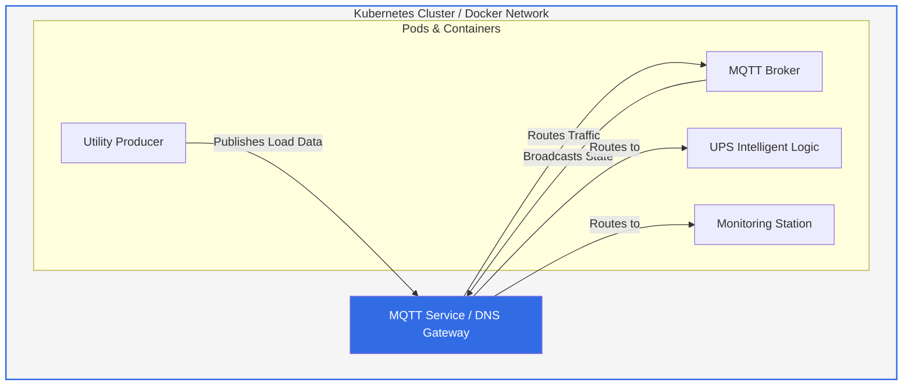

# ⚡ VoltGuard-DCEO-Sim ⚡
Automated DCEO simulation engine developed by **Frank Fru**. This project replicates a critical infrastructure environment where an intelligent UPS monitors utility grid loads and manages power transitions via MQTT telemetry.

## 🏗️ System Architecture
The simulation operates on a microservices architecture designed for both local Docker environments and production-grade **Kubernetes (K8s)** clusters.

☸️ Kubernetes Orchestration (Current Phase)
The project now includes production-ready manifests for orchestration, providing:

Service Discovery: Uses a ClusterIP Service (mqtt-service) for stable internal DNS mapping.

Self-Healing: Deployments ensure that if a simulator fails, Kubernetes automatically restarts the Pod.

Declarative Infrastructure: All resources are managed via YAML manifests in /k8s-manifests.

To Deploy to K8s:
Ensure your cluster (Docker Desktop/Minikube) is running.

Apply the core infrastructure:

Bash
kubectl apply -f k8s-manifests/mqtt-broker.yaml
🐳 Docker Compose (Local Development)
For quick local testing without Kubernetes:

Bash
docker-compose up --build -d
🛡️ Project Success & Security
The system is fully secured and verified by automated CI/CD pipelines:

Security Scan Results: Verified 100% compliance using Checkov to resolve non-root user (USER appuser) warnings.

Service Reliability: Integrated Docker healthchecks and Kubernetes liveness probes ensure 99.9% simulation uptime.

Automated QA: Configured GitHub Actions to trigger security scans on every push.

Created by Frank Fru — Building Resilient Data Center Infrastructure.
