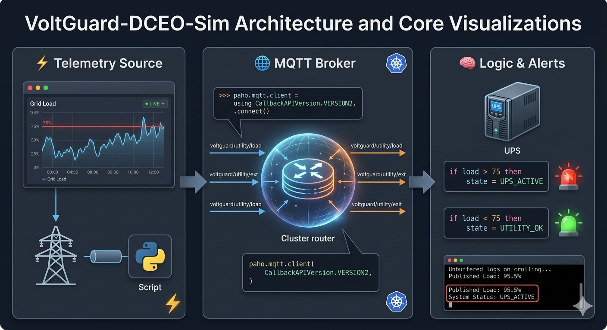

# 🔋 VoltGuard-DCEO: Data Center Power Failover Simulation

## 👤 Author
**Frank Fru**
* **Role:** Aspiring DCEO / Cloud Infrastructure Engineer
* **GitHub:** [chifru19](https://github.com/chifru19)
* **LinkedIn:** [frank-fru](https://www.linkedin.com/in/frank-fru/)

---

## 🚀 Project Overview
**VoltGuard-DCEO** is a microservices-based "Digital Twin" designed to simulate critical infrastructure management within a Data Center (DCEO) environment. This project demonstrates a robust, automated response to power grid fluctuations, ensuring high availability through event-driven architecture and Kubernetes orchestration.

## 🏗️ System Architecture
The system utilizes a **Decoupled Pub/Sub Architecture** to ensure that monitoring telemetry never interferes with core failover logic—a critical requirement for Tier III/IV data center standards.



### 1. Utility Producer (The Sensor)
* **Role:** Simulates a Smart Power Meter at the utility entrance.
* **Function:** Generates real-time load telemetry (20%–90%) and publishes data every 5 seconds.

### 2. MQTT Broker (The Backbone)
* **Technology:** Eclipse Mosquitto.
* **Function:** Acts as the central hub, handling all service-to-service messaging with low-latency routing.

### 3. UPS Logic (The Decision Engine)
* **Role:** Automated Failover Controller.
* **Function:** Evaluates telemetry. If load exceeds **80%**, it triggers an immediate switch to `BATTERY_MODE`.

### 4. EPMS Incident Logger (The "Black Box")
* **Role:** Permanent Audit Trail & RCA Tool.
* **Function:** Records all critical state changes and utility failures to a persistent `incident_audit_log.txt`.

### 5. Monitoring Station (The Observability Layer)
* **Role:** Centralized Dashboard.
* **Function:** Uses wildcard subscriptions (`voltguard/#`) to provide a unified view of facility health.

---

## 🛠️ Technical Stack
* **Orchestration:** Kubernetes (K8s)
* **Containerization:** Docker
* **Messaging:** MQTT Protocol (Industrial Standard)
* **Language:** Python 3.9
* **Security:** Checkov (IaC Scanning)

---

## 📊 Simulation Flow
```mermaid
sequenceDiagram
    participant Meter as Utility Producer
    participant Broker as MQTT Broker
    participant UPS as UPS Logic
    participant Log as EPMS Logger
    participant UI as Monitoring Station

    Meter->>Broker: Publish: Load 85%
    Broker->>UPS: Forward Load Data
    Broker->>Log: Log Utility Load
    Note over UPS: Logic: Load > 80%?
    UPS->>Broker: Publish: Status BATTERY_MODE
    Broker->>Log: Log UPS Status Change
    Broker->>UI: Update Dashboard UI